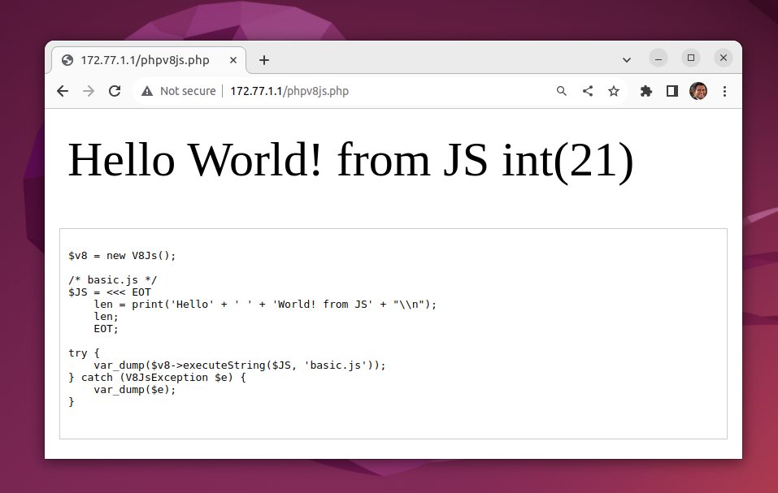

# PHP V8 JS



https://www.php.net/manual/en/book.v8js.php

https://v8.dev/

https://en.wikipedia.org/wiki/V8_(JavaScript_engine)

# V8 JavaScript Engine

V8 is Google's open source JavaScript engine.

V8 implements ECMAScript as specified in ECMA-262.


(Others: https://v8.dev/logo)

V8 is written in C++ and is used in Google Chrome, the open source browser from Google.

V8 can run standalone, or can be embedded into any C++ application.

V8 Project page: https://v8.dev/docs

# PHPv8JS Docker

```
docker compose up -d --build
```